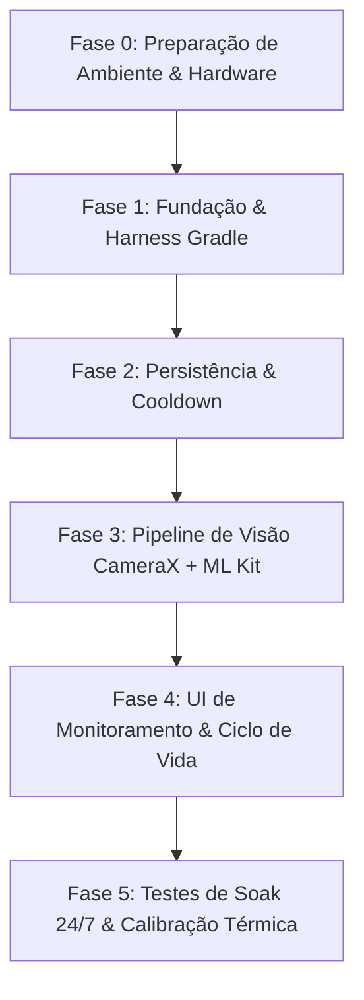

# Protocolo e Governança de Agentes de IA: CatWatch A12

Este documento estabelece o guia de conduta, papéis, rastreabilidade técnica, roadmap e o protocolo de esclarecimento de requisitos para agentes de IA que atuam no desenvolvimento e manutenção do projeto **CatWatch A12**.

---

## 1. Visão Geral e Princípios Fundamentais

O projeto **CatWatch A12** tem como objetivo transformar um smartphone **Samsung Galaxy A12 (`SM-A127M`)** em uma câmera autônoma de monitoramento contínuo (24/7) dedicada à detecção de gatos, priorizando eficiência energética e proteção térmica.

Para evitar duplicação de informações e manter uma **única fonte da verdade (Single Source of Truth - SSOT)**, todas as especificações técnicas detalhadas, exemplos de código de referência e instruções operacionais do dispositivo estão centralizadas em [DIRECIONAMENTO.md](file:///home/melo/Documentos/GitHub/CatWatch-A12/DIRECIONAMENTO.md).

### Invariantes Inegociáveis para Agentes

1. **Zero Gravação de Vídeo:** Sob nenhuma hipótese adicione bibliotecas de gravação de vídeo contínua (`VideoCapture` ou `MediaRecorder`). O projeto opera estritamente com análise em memória (`ImageAnalysis`) e fotos pontuais sob demanda (`ImageCapture`).
2. **Buffer Safety Mandatória:** Toda chamada ao `ImageProxy` no analisador deve encerrar obrigatoriamente com `imageProxy.close()`, independentemente de exceções, sucesso ou descarte por throttle.
3. **Respeito ao Hardware Exynos 850:** Nunca eleve a taxa de inferência acima de 2 FPS e nunca execute inferência ou I/O em disco na thread principal (*MainThread*).

---

## 2. Matriz de Rastreabilidade Técnica

Antes de propor alterações ou gerar novos componentes, os agentes **devem consultar as seções correspondentes** em [DIRECIONAMENTO.md](file:///home/melo/Documentos/GitHub/CatWatch-A12/DIRECIONAMENTO.md):

| Tópico / Domínio | Seção em `DIRECIONAMENTO.md` | Diretriz Principal |
| :--- | :--- | :--- |
| **Limitações de Hardware** | [§ 2. Requisitos de Hardware](file:///home/melo/Documentos/GitHub/CatWatch-A12/DIRECIONAMENTO.md#2-requisitos-de-hardware-e-premissas-de-otimizacao) | Exynos 850 sem NPU: 1–2 FPS max, 640x480 VGA, descarte precoce. |
| **Fluxo e Arquitetura** | [§ 3. Arquitetura do Sistema](file:///home/melo/Documentos/GitHub/CatWatch-A12/DIRECIONAMENTO.md#3-arquitetura-do-sistema) | Diagrama de fluxo: Stream $\rightarrow$ Dual Use Cases $\rightarrow$ Analyzer $\rightarrow$ Cooldown $\rightarrow$ Snapshot. |
| **Stack e Dependências** | [§ 4. Stack Tecnológica](file:///home/melo/Documentos/GitHub/CatWatch-A12/DIRECIONAMENTO.md#4-stack-tecnologica-e-dependencias) | Java 17 LTS, Kotlin 1.9+, CameraX 1.3.1, ML Kit Image Labeling 17.0.9, Room 2.6.1 + KSP. |
| **Lógica de Visão Computacional** | [§ 5.1. CatDetectorAnalyzer](file:///home/melo/Documentos/GitHub/CatWatch-A12/DIRECIONAMENTO.md#51-analisador-com-subamostragem-e-filtro-semantico-catdetectoranalyzerkt) | Filtro semântico para "Cat", "Kitten", "Felidae" com confiança $\ge 0.60$. |
| **Disparo e Anti-Duplicação** | [§ 5.2. CaptureCoordinator](file:///home/melo/Documentos/GitHub/CatWatch-A12/DIRECIONAMENTO.md#52-gerenciador-de-disparo-e-cooldown-capturecoordinatorkt) | Cooldown configurável (15s a 45s) entre disparos consecutivos para o mesmo animal. |
| **Persistência de Metadados** | [§ 5.3. CatEventEntity](file:///home/melo/Documentos/GitHub/CatWatch-A12/DIRECIONAMENTO.md#53-modelo-de-dados-de-auditoria-catevententitykt) | Tabela `cat_events` no Room com timestamp, caminho da foto e confiança. |
| **Manifesto e Permissões** | [§ 6. Permissões e Manifesto](file:///home/melo/Documentos/GitHub/CatWatch-A12/DIRECIONAMENTO.md#6-configuracoes-de-permissoes-e-manifesto) | Câmera, WakeLock, Foreground Service Camera e Notificações. |
| **Operação no Galaxy A12** | [§ 7. Instruções no Aparelho](file:///home/melo/Documentos/GitHub/CatWatch-A12/DIRECIONAMENTO.md#7-instrucoes-operacionais-no-aparelho-galaxy-a12) | Bloqueio de carga em 85%, bateria irrestrita na One UI, tela no brilho mínimo. |

---

## 3. Roadmap de Desenvolvimento do Projeto

O desenvolvimento deve ser executado de forma incremental seguindo as 5 fases estruturadas abaixo:



### Fase 0: Preparação de Ambiente & Hardware

* [x] Instalar Java 17 LTS e configurar runtime no sistema (`Temurin-17.0.20.1`).
* [x] Instalar o Android Studio (configurado via JetBrains Toolbox).
* [x] Instalar `android-tools` (`/usr/bin/adb` operacional).
* [x] Configurar variáveis `ANDROID_HOME` e `PATH` no `~/.bashrc`.
* [x] Fixar `JAVA_HOME` para o JDK 17 e sincronizar `javac` com a versão 17.
* [x] Instalar o pacote de plataforma **Android 14 (API 34)** e **Build-Tools 34.0.0** no SDK Manager.
* [x] Conectar o Samsung Galaxy A12 via USB e autorizar a chave de Depuração USB (`adb devices`).
* **Gate de Aceite:** `adb devices` lista o Galaxy A12 como `device` e o SDK 34 está disponível localmente. (CONCLUÍDO)

### Fase 1: Fundação e Harness Gradle

* [ ] Configurar `settings.gradle.kts` e `build.gradle.kts` na raiz do repositório.
* [ ] Configurar `app/build.gradle.kts` com:
  * Suporte a Java 17 (`sourceCompatibility`, `targetCompatibility`, `jvmTarget = "17"`).
  * Plugins: `com.android.application`, `org.jetbrains.kotlin.android`, `com.google.devtools.ksp`.
  * Dependências especificadas em [§ 4 de DIRECIONAMENTO.md](file:///home/melo/Documentos/GitHub/CatWatch-A12/DIRECIONAMENTO.md#4-stack-tecnologica-e-dependencias).
* [ ] Configurar `gradle.properties` com limites de memória controlados (`-Xmx2048m`).
* [ ] Criar estrutura de pacotes: `com.catwatch.detector` (`camera`, `core`, `data`, `ui`).
* **Gate de Aceite:** `./gradlew assembleDebug` compila sem erros ou avisos críticos.

### Fase 2: Persistência e Coordenação de Disparos

* [ ] Implementar `CatEventEntity` e criar `CatEventDao` (operações: `insert`, `getAllEventsPaged`, `deleteOldEvents`).
* [ ] Criar `CatWatchDatabase` via Room.
* [ ] Implementar `CaptureCoordinator` com:
  * Lógica de cooldown temporal (15s padrão).
  * Gestão de diretório em disco (`filesDir/cat_events`).
  * Despacho de gravação em thread de I/O dedicada.
* **Gate de Aceite:** Testes unitários validando que candidatos recebidos durante a janela de cooldown são ignorados.

### Fase 3: Pipeline de Visão Computacional (CameraX + ML Kit)

* [ ] Implementar `CatDetectorAnalyzer` implementando `ImageAnalysis.Analyzer`:
  * Subamostragem por timestamp (descarte se intervalo < 500ms).
  * Conversão de `ImageProxy` para `InputImage`.
  * Integração com `com.google.mlkit:image-labeling` on-device com threshold $\ge 0.60$.
  * Garantia de fechamento de buffer `imageProxy.close()` em `addOnCompleteListener`.
* **Gate de Aceite:** O analisador processa frames sem estourar o limite de 2 FPS e libera 100% dos buffers.

### Fase 4: Interface de Monitoramento e Integração do Ciclo de Vida

* [ ] Criar `activity_main.xml` dividido:
  * Metade superior: `androidx.camera.view.PreviewView` com `implementationMode = COMPATIBLE`.
  * Metade inferior: `RecyclerView` com feed cronológico reverso dos snapshots.
* [ ] Implementar `CatEventAdapter` com carregamento assíncrono de thumbnails (evitando *OutOfMemory*).
* [ ] Implementar fluxo de permissões dinâmicas em tempo de execução para Câmera e Notificações.
* [ ] Vincular CameraX ao ciclo de vida da `MainActivity` (`ProcessCameraProvider`).
* **Gate de Aceite:** App inicia a câmera, exibe a imagem e atualiza a lista instantaneamente ao detectar um gato.

### Fase 5: Operação 24/7 e Homologação no Galaxy A12

* [ ] Implementar serviço de primeiro plano (`ForegroundService`) com notificação persistente para prevenir finalização pelo Android.
* [ ] Validar o consumo de CPU no Android Studio Profiler (alvo: 15%–25% sustentado).
* [ ] Validar retenção de snapshots e política de purga de disco para não esgotar o armazenamento interno.
* [ ] Aplicar as instruções operacionais de bateria e tela especificadas em [§ 7 de DIRECIONAMENTO.md](file:///home/melo/Documentos/GitHub/CatWatch-A12/DIRECIONAMENTO.md#7-instrucoes-operacionais-no-aparelho-galaxy-a12).
* **Gate de Aceite:** Dispositivo opera por 4 horas ininterruptas sem travamento, sem aquecimento excessivo e sem vazamento de memória.

---

## 4. Papéis e Especializações dos Agentes

Quando múltiplos agentes ou personas atuarem no repositório, as seguintes responsabilidades devem ser observadas:

1. **Lead Architect / System Integrity Agent:**
   * Guardião do consumo térmico e de memória.
   * Valida conformidade das versões (Java 17, KSP, CameraX).
   * Impede a inclusão de dependências desnecessárias ou bibliotecas de UI pesadas (ex: Compose completo caso não seja estritamente necessário).
2. **Vision & Camera Specialist:**
   * Foco no `CatDetectorAnalyzer` e configuração do `ProcessCameraProvider`.
   * Garante que resoluções nunca excedam 640x480 no canal de análise.
3. **Data & Storage Specialist:**
   * Foco em Room, DAOs e gravação de arquivos JPG.
   * Garante que o disco não seja fragmentado com excesso de chamadas I/O simultâneas.
4. **UI & Experience Specialist:**
   * Foco na `MainActivity` e no `RecyclerView`.
   * Garante decodificação eficiente de imagens para não travar a rolagem da lista.

---

## 5. Protocolo de Esclarecimento de Especificações (Escalation Protocol)

Quando um agente identificar uma especificação ambígua, ausente ou conflitante, ele **NÃO DEVE** assumir decisões que afetem performance ou arquitetura. Deve acionar o seguinte protocolo estruturado de escalonamento:

### Formato de Escalonamento de Dúvidas

```markdown
### [ESCALONAMENTO DE ESPECIFICAÇÃO]
- **Componente Afetado:** (ex: CaptureCoordinator / CatDetectorAnalyzer)
- **Referência em DIRECIONAMENTO.md:** (ex: Seção 5.2)
- **Ambiguidade / Incerteza Identificada:** (descrição objetiva da dúvida)
- **Risco Técnico no Galaxy A12:** (ex: impacto térmico, consumo de memória, concorrência de I/O)
- **Alternativas Avaliadas:**
  1. Alternativa A (prós e contras)
  2. Alternativa B (prós e contras)
- **Recomendação do Agente:** (qual abordagem técnica é mais segura e por quê)
```

---

## 6. Gates de Qualidade Automatizados

Todo pull request ou entrega de código gerada por agentes deve ser checada contra a seguinte lista de verificação antes de ser considerada concluída:

* [ ] **JDK 17 Compliance:** Nenhuma sintaxe incompatível com o compilador Java 17 foi inserida.
* [ ] **Zero-Leak Camera Buffer:** Todos os caminhos de código dentro de `ImageAnalysis.Analyzer` invocam `imageProxy.close()`.
* [ ] **Background Threading:** A chamada `ImageCapture.takePicture()` e o processamento de banco Room utilizam executores assíncronos (`Dispatchers.IO` ou `ExecutorService`).
* [ ] **Cooldown Respeitado:** O timestamp de última captura é validado antes de invocar `takePicture()`.
* [ ] **Imagens Otimizadas:** A resolução de análise está travada em VGA (640x480).
