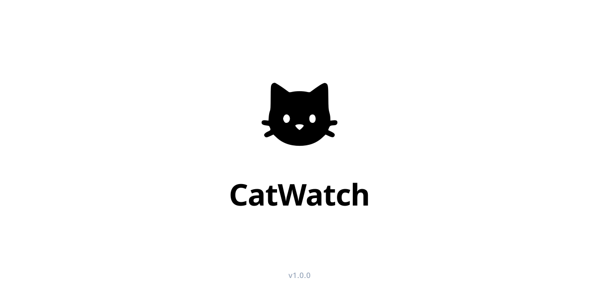

# CatWatch

  

  <strong>Transformando um smartphone Android em uma câmera inteligente de monitoramento 24/7 para seus gatos.</strong>  
  Sem gravação contínua de vídeo. Sem envio para a nuvem. 100% privado e com baixo consumo.

  <strong>Repositório Oficial</strong> 
  
  
  
  
  

---

## O que é o CatWatch?

O **CatWatch** é um aplicativo criado para dar uma nova utilidade a smartphones Android antigos ou sobressalentes, transformando-os em estações fixas de monitoramento para gatos (e.g., apontados para potes de água, comedouros ou caixas de areia).

Diferente de uma câmera, que grava horas ininterruptas de vídeo, o CatWatch analisa a imagem em tempo real na memória e só registra fotos pontuais em alta definição quando detecta a presença de um gato, afim de evitar superaquecimento, degradação da bateria, consumo excessivo de espaço de armazenamento e de internet (pois não há envio para a nuvem).

---

## Principais Recursos

* **Inteligência Artificial no Aparelho:** Utiliza o Google ML Kit localmente. Nenhuma imagem ou dado sai do seu celular para a internet, valendo frisar que esse algoritmo de machine learning treinado pela Google não é um modelo de linguagem (LLM) e sim um classificador de imagens.
* **Estratégia Dual-Snapshot ($T_0$ e $T_5$):**
  * Dispara uma foto imediata assim que o gato se aproxima ($T_0$).
  * Dispara uma foto de confirmação 15 segundos depois ($T_5$), para verificar se o animal permaneceu bebendo água ou comendo, etc.
* **Sistema Anti-Duplicação (Cooldown de 2 min):** Entra em repouso temporário depois de cada evento para não encher a memória com fotos repetidas da mesma "visita".
* **Organização em Álbuns por Hora:** As capturas são armazenadas no diretório privado do aplicativo e organizadas no próprio app em cards de álbum com horário de visita (ex: `17:00 ~ 18:00`).
* **Visualizador em Tela Cheia:** Toque em qualquer álbum para navegar pelas fotos com deslize horizontal e indicador de páginas.
* **Filtros e Exclusão em Lote:** Filtre rapidamente por *Hoje*, *Últimas 24h* ou selecione períodos específicos no calendário, com opção de apagar álbuns inteiros com um toque.
* **Limpeza Automática:** Remove automaticamente registros e fotos com mais de 30 dias para evitar o esgotamento do armazenamento interno.
* **Operação Contínua 24/7:** Executa como serviço de primeiro plano, garantindo que o sistema não encerre o monitoramento.

---

## Modos de Operação

Na barra superior do aplicativo, você pode alternar facilmente entre 3 modos:

1. **Desligado:** Sensor de câmera totalmente desativado. Não consome bateria nem processamento. Pra caso você queira paz de espírito sabendo que a câmera não está sendo utilizada.
2. **Enquadrar:** Exibe a imagem da câmera na tela para você posicionar e ajustar o ângulo do celular no ambiente, sem disparar a inferência da inteligência artificial.
3. **Monitorar:** Modo de vigilância ativo. Câmera, inferência de IA e serviço de segundo plano ficam operacionais para capturar as visitas dos seus gatos ao local monitorado.

---

## Como Instalar e Usar

1. Baixe o APK mais recente na aba de [Releases](https://github.com/araujosemacento/CatWatch-A12/releases).
2. Instale o APK no seu aparelho Android (Android 8.0 ou superior).
3. Ao abrir o app pela primeira vez, conceda as permissões solicitadas (Câmera e Notificações - essas últimas são exclusivamente pra exibir toasts informativos. O aplicativo não envia notificações push e funciona perfeitamente sem elas, mas foram bastante usadas durante o desenvolvimento).
4. Posicione o celular em um suporte estável apontado para o local desejado (ex: fonte de água do gato).
5. No topo da tela, selecione **Enquadrar** para conferir o enquadramento e, em seguida, alterne para **Monitorar**.
6. Pronto! O aplicativo agora registrará as visitas automaticamente.

> **Dica para uso contínuo (24/7):**
>
> * Mantenha o aparelho conectado a um carregador de boa qualidade.
> * Se o seu celular tiver a opção de "Proteger Bateria" (limite em 85%), ative-a nas configurações do Android.
> * Reduza o brilho da tela ao mínimo para economizar energia e manter a temperatura baixa.

---

## Tecnologias Utilizadas

Para desenvolvedores interessados na arquitetura ou em realizar suas próprias melhorias:

* **Linguagem:** Kotlin (Java 17 LTS)
* **Câmera:** AndroidX CameraX (`ImageAnalysis` + `ImageCapture`)
* **Visão Computacional:** Google ML Kit Image Labeling
* **Banco de Dados Local:** Room com SQLite e KSP
* **Interface:** Material Design Components, ViewPager2, DiffUtil ListAdapter

Para detalhes técnicos, guias de governança da arquitetura ou desenvolvimento assistido por LLMs, consulte o arquivo [AGENTS.md](AGENTS.md).

---

## Licença

Este projeto é distribuído sob os termos da licença [MIT](LICENSE.md). Sinta-se livre para utilizar e modificar!

## Contribuições

Não pretendo aceitar contribuições de terceiros neste projeto. Sinta-se livre para utilizar este código para seus próprios fins, mas não pretendo aceitar pull requests, visto que esse foi um projeto pessoal desenvolvido ao longo de uma semana para um própósito muito específico.
